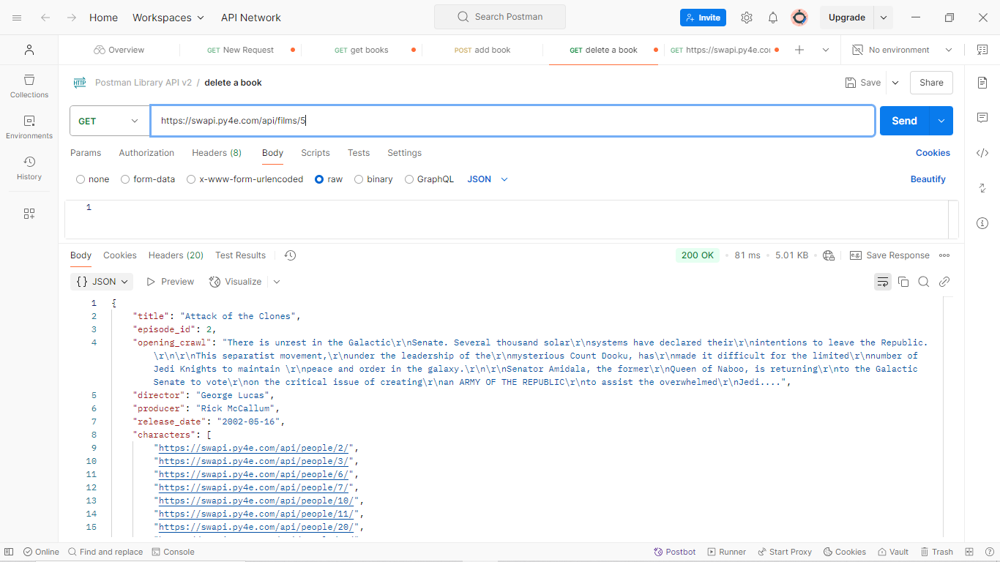
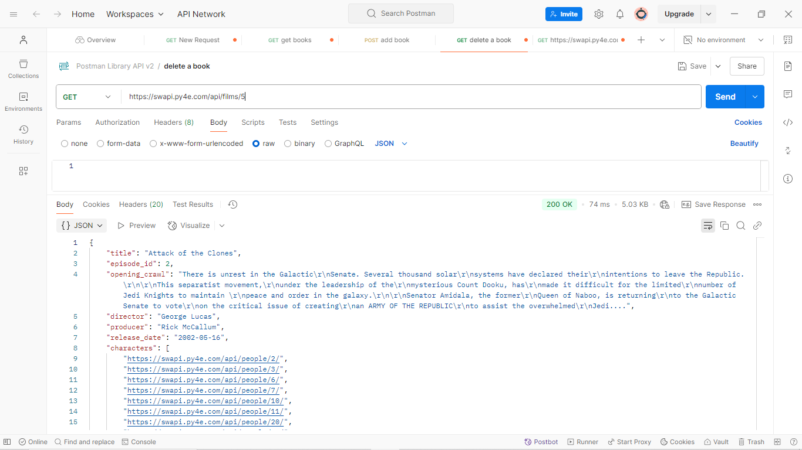

# Star Wars API 🎬✨

Este proyecto interactúa con la API pública de Star Wars para consultar información sobre las películas de la saga utilizando Java y la librería Gson. Se pueden obtener datos como el título, director, fecha de estreno, y más, de cada película. Además, permite guardar la información en un archivo JSON para su posterior uso.

## Características 🔍

- Consulta información de las películas de Star Wars usando su número de episodio.
- Conexión con la API pública de Star Wars (`https://swapi.py4e.com/api/films`).
- Almacena los datos de la película en un archivo JSON usando Gson.
- Manejo adecuado de excepciones y mensajes de error.

## Requisitos 🚀

- JDK 17 o superior (recomendado JDK 23)
- IntelliJ IDEA o cualquier IDE compatible con Java
- Librería Gson (incluida en el proyecto)

## Instalación 📥

1. Clona el repositorio:

   ```bash
   git clone https://github.com/tuusuario/starwarsapi.git
   ```

2. Abre el proyecto en tu IDE preferido (ej. IntelliJ IDEA).

3. Asegúrate de tener la librería Gson configurada en tu `classpath`.

4. Ejecuta el archivo `Principal.java` para comenzar.

## Uso 👨‍💻

1. Ejecuta el proyecto.
2. Ingresa el número de la película de Star Wars que deseas consultar (por ejemplo, 1 para "A New Hope").
3. La información de la película se mostrará en consola y se guardará en un archivo JSON con el nombre de la película.

## Ejemplo de ejecución 🎥

```
Escriba el número de la película de Star Wars que quiere consultar: 
1
Pelicula: Star Wars
Director: George Lucas
Fecha de estreno: 1977-05-25

El archivo "Star Wars.json" ha sido creado.
```

## Contribuciones 🤝

¡Las contribuciones son bienvenidas! Si tienes ideas para mejorar el proyecto, no dudes en crear un **pull request** o abrir un **issue**.

## Licencia 📄

Este proyecto está bajo la licencia MIT. Ver el archivo [LICENSE](LICENSE) para más detalles.

---

## Agradecimientos 🙏🌟
Quiero agradecer profundamente a Alura Latam y al programa One Oracle Next Education por el curso tan completo y enriquecedor que he recibido. Gracias a su excelente material y formación, puedo mejorar mis habilidades en desarrollo de software y avanzar en proyectos como este. 👩‍💻🚀

¡Muchas gracias por ofrecer una educación de calidad que hace la diferencia! 💡🎓

---


